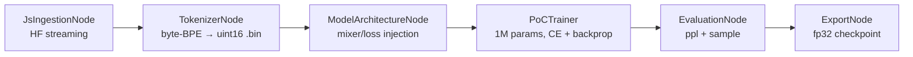

# llmdev — Local LLM Research Framework

Plug-and-play **node-graph pipeline** for LLM experimentation, built entirely in
Node.js/TypeScript. Runs headless via CLI or interactively through a Vue 3 SVG
canvas mirrored in real time over WebSockets. Designed for a **100GB total disk
budget** on a Linux Mint 22.3 host with an NVIDIA RTX 5060 Ti.

## File layout

```
llmdev/
├── .devcontainer/
│   ├── devcontainer.json        # GPU passthrough, cache-volume disk policy
│   ├── Dockerfile               # CUDA 12.8 (Blackwell) + Node 22 + toolchain
│   └── post-create.sh           # deps install + GPU/disk sanity checks
├── scripts/
│   └── disk-guard.sh            # 100GB budget audit (warn 80% / fail 95%)
├── pipelines/
│   └── poc-js-1m.json           # the 6-node PoC graph (pure data, UI-editable)
├── src/
│   ├── cli.ts                   # headless runner: run | validate | catalog
│   ├── core/                    # ── node-tree engine ──
│   │   ├── types.ts             # PipelineNode, ports, specs, snapshots
│   │   ├── Registry.ts          # plug-and-play node factory catalog
│   │   └── Engine.ts            # topo-sort executor + state/metric events
│   ├── ml/                      # ── injectable ML primitives ──
│   │   ├── tokenizer.ts         # byte-level BPE → uint16 ids
│   │   ├── layers.ts            # SequenceMixer/LossFn registries (inject C++/PyTorch here)
│   │   └── model.ts             # TinyLM ~1M params, exact backprop, Adam
│   ├── nodes/
│   │   ├── index.ts             # registers all built-in nodes
│   │   ├── data/JsIngestionNode.ts      # HF streaming API, zero raw data on disk
│   │   ├── tokenizer/TokenizerNode.ts   # stream → packed uint16 .bin shard
│   │   ├── model/ModelArchitectureNode.ts
│   │   ├── train/PoCTrainer.ts          # real CE loss + backward + 1M-param update
│   │   ├── eval/EvaluationNode.ts       # held-out loss, perplexity, sample gen
│   │   └── export/ExportNode.ts         # JSON header + fp32 .weights.bin (~4MB)
│   └── server/
│       ├── protocol.ts          # typed WS wire protocol (shared contract)
│       └── index.ts             # WebSocket bridge on :8081
└── webapp/                      # ── Vue 3 + TS + Tailwind ──
    └── src/
        ├── stores/pipeline.ts   # Pinia store ↔ WS mirror of the engine
        └── components/
            ├── NodeCanvas.vue   # 2D SVG playground: drag/pan/zoom/select
            ├── GraphNode.vue    # status glow, category color, typed ports
            ├── PropertyPanel.vue# schema-driven param editor (mixer swap etc.)
            ├── MetricsBar.vue   # live loss sparkline, tok/s, VRAM, RSS
            └── LogConsole.vue
```

## Quick start (inside the dev container)

```bash
npm run poc            # headless: stream HF JS → tokenize → train 1M model → eval → export
npm run server         # WebSocket bridge (preload: npm run server -- pipelines/poc-js-1m.json)
npm run webapp:dev     # Vue canvas on http://localhost:5173
npm run disk:check     # audit the 100GB budget
npm run cli -- catalog # list registered node types
```

Gated datasets (e.g. `bigcode/starcoderdata`): `export HF_TOKEN=hf_…` first.

## Pipeline topology



## Disk policy (100GB budget)

| Concern | Mitigation |
| --- | --- |
| Raw datasets | Never written — HF rows API streamed straight into the tokenizer |
| Token shards | uint16 packing, hard `maxTokens` cap (2M tokens ≈ 4MB) |
| Caches (npm/pip/HF) | Redirected to the `llmdev-cache` named volume — prunable in one command |
| Checkpoints/exports | `llmdev-artifacts` volume; fp32 1M-param ckpt ≈ 4MB |
| Container `/tmp` | tmpfs capped at 2GB |
| Auditing | `npm run disk:check` (fails CI-style at 95%) |

## Extending (injection points)

- **Custom attention / kernels**: implement `SequenceMixer` (see `src/ml/layers.ts`),
  `registerMixer("my-flash-attn", …)` — pure JS, WASM, or an N-API C++/CUDA addon
  (toolchain + nvcc are preinstalled in the container).
- **Custom losses**: implement `LossFn`, `registerLoss(…)`.
- **Custom pipeline nodes** (PyTorch bridge, dataset filters, RLHF stages):
  implement `PipelineNode` and `registerNode(…)` — the engine, CLI, WS protocol,
  and UI palette pick them up automatically.
